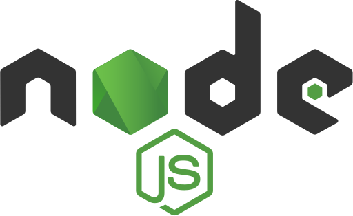
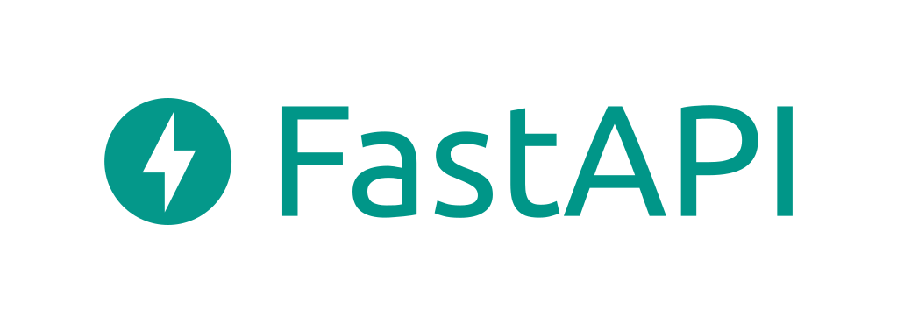

- 👋 Hi, I’m @muhduzairmf

- 👀 I’m interested in 
  1. Software Development
  2. Networking
  3. Cyber Security
  4. Operating System
  5. Cloud Services

- 🌱 Technology that I am using and still currently learning to improve myself.
  
  1. **Frontend Development**
<table>
    <tbody>
        <tr>
            <td align="center"></td>
            <td align="center"></td>
            <td align="center"></td>
            <td align="center"></td>
            <td align="center"></td>
        </tr>
    </tbody>
</table>

  2. **Backend Develepment**
<table>
    <tbody>
        <tr>
            <td align="center"></td>
            <td align="center"></td>
        </tr>
        <tr>
            <td align="center"></td>
            <td align="center"></td>
        </tr>
        <tr>
            <td align="center"></td>
            <td align="center"></td>
        </tr>
    </tbody>
</table>

  3. **Databases**
<table>
    <tbody>
        <tr>
            <td align="center"></td>
            <td align="center"></td>
            <td align="center"></td>
        </tr>
    </tbody>
</table>

  4. **Others**
<table>
    <tbody>
        <tr>
            <td align="center"></td>
            <td align="center"></td>
            <td align="center"></td>
            <td align="center"></td>
            <td align="center"></td>
        </tr>
    </tbody>
</table>
