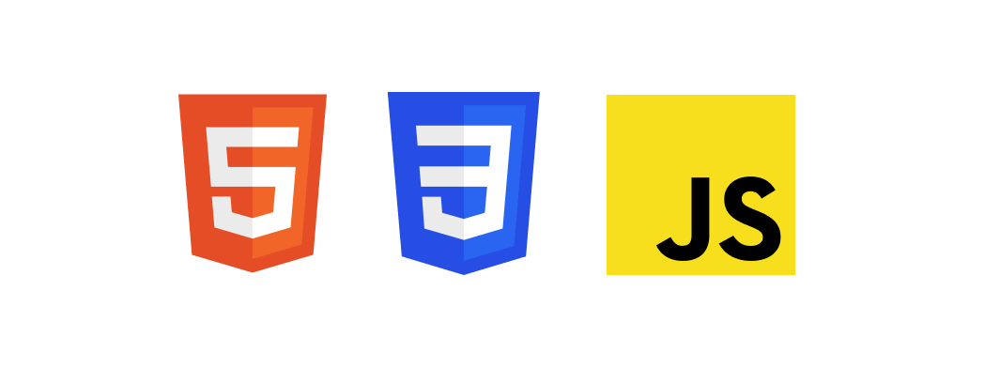
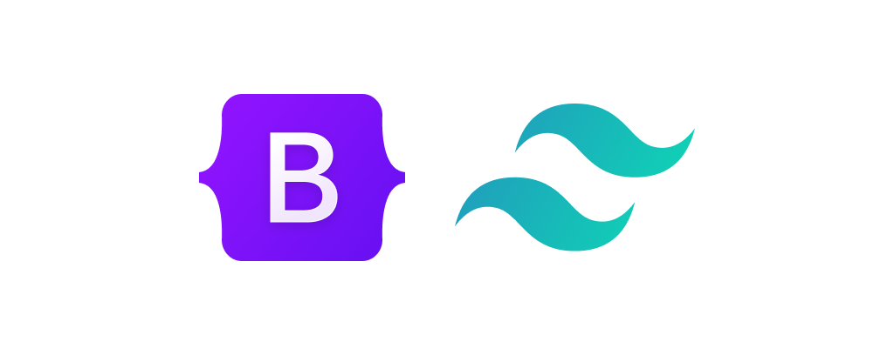
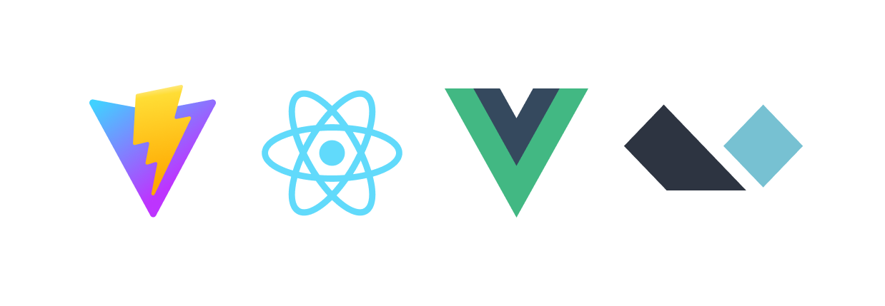
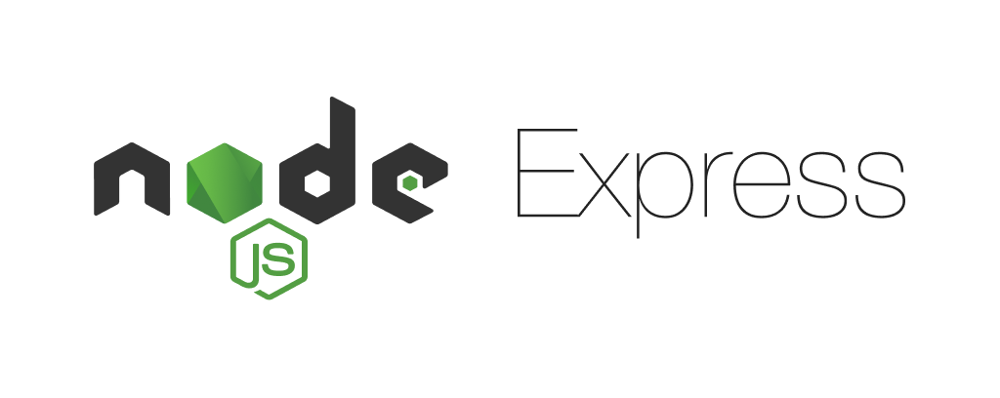
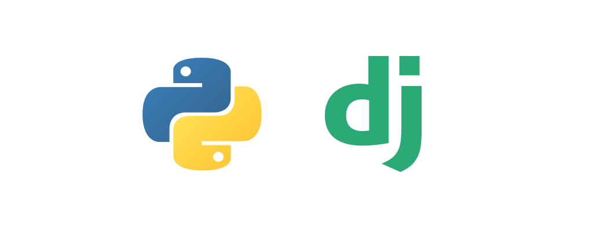
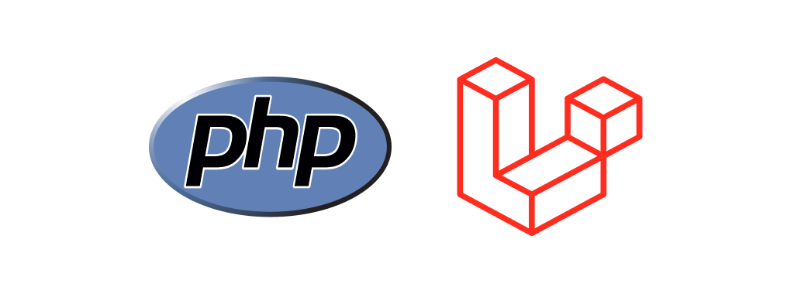
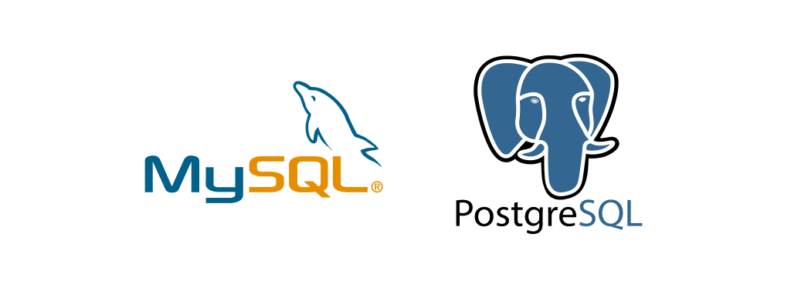
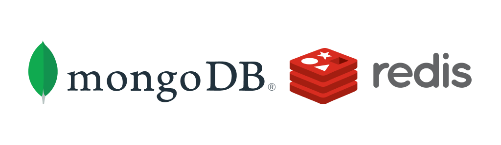

# Hello! My name is Muhammad Uzair 👦    

- 💻 I am student in Bachelors Degree of Computer Science (Software Engineering) with honours.     

- 👀 I am interested in 
  1. Front-end Development
  2. Back-end Development
  3. DevOps
  4. Cloud Computing
  5. Information Security

- ✨ I am passionate about any IT related field, especially in my interesting above. So I can spend time to learn something new.

- 🌱 Technology that I am using and still currently learning to improve myself.        

HTML, CSS, JavaScript   
     
    
[Bootstrap](https://getbootstrap.com/), [TailwindCSS](https://tailwindcss.com/)   

    
[Vite](https://vitejs.dev/), [React.js](https://reactjs.org/), [Vue.js](https://vuejs.org/), [Alpine.js](https://alpinejs.dev/)    
     
  
[Node.js](https://nodejs.org/en/), [Express](https://expressjs.com/)   
     
   
[Python](https://www.python.org/), [Django](https://www.djangoproject.com/)            
     
   
[PHP](https://www.php.net/), [Laravel](https://laravel.com/)   
     
  
[MySQL](https://www.mysql.com/), [PostgreSQL](https://www.postgresql.org/)    
     
  
[MongoDB](https://www.mongodb.com/), [Redis](https://redis.io/)   
     
  
[Docker](https://www.docker.com/)   
     
   
[GitHub](https://github.com/)   
     
  
[Nginx](https://www.nginx.com/)    
     
     
[Visual Studio Code](https://code.visualstudio.com)   
       

